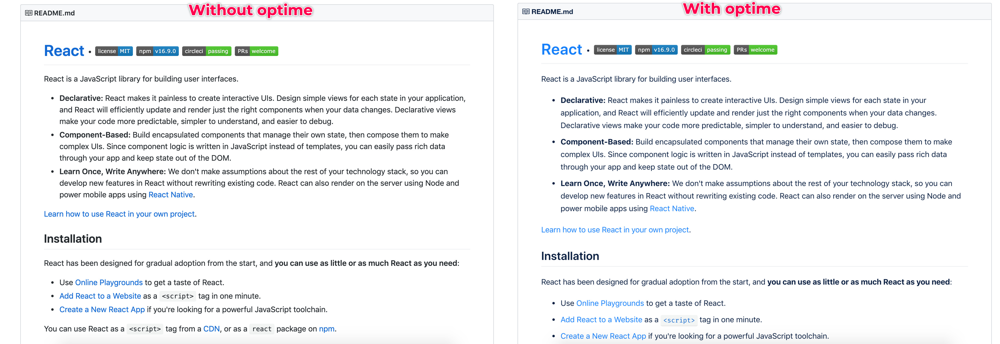

    
  

    <h3 align="center"> Optime</h3>
 
A css framework fully optimised for better readability.

  
  
  
  
  
  
  
    

------

### Install

### What?

### Why?

### How?

## Browser support
Optime uses [Autoprefixer](https://github.com/postcss/autoprefixer) to make most styles compatible with earlier browsers and [Normalize.css](https://necolas.github.io/normalize.css/) for CSS resets. Optime is designed for modern browsers. For best compatibility, these browsers are recommended:

- Chrome (LAST 4)
- Microsoft Edge (LAST 4)
- Firefox (EXTENDED SUPPORT RELEASE)
- Safari (LAST 4)
- Opera (LAST 4)
- Internet Explorer 10+

## Author

👤 **naveenda <mailtomassnaveen@gmail.com>**

* Twitter: [@naveenda_](https://twitter.com/naveenda_)
* Github: [@NaveenDA](https://github.com/NaveenDA)

### Used by

### Copyright and license
Code copyright 2019 Naveen. Code released under the [MIT](LICENSE) license.

